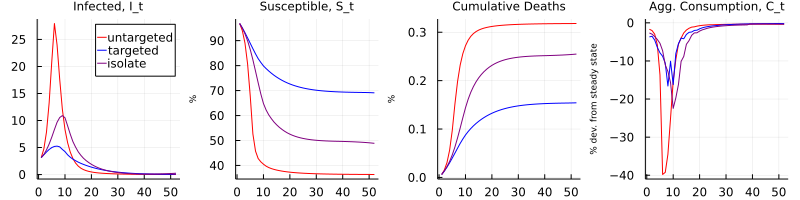

# Replication of Chari, Kirpalani, and Phelan (2021)

> This project was conducted as a final assignment for the PhD course [Numerical Methods](https://floswald.github.io/NumericalMethods/) at Bocconi University in Fall 2021. 

This package replicates the main figures of Chari, Kirpalani, and Phelan (2021): "*The hammer and the scalpel: On the economics of indiscriminate versus targeted isolation policies during pandemics*", published in the Review of Economic Dynamics. The paper is available [here](https://doi.org/10.1016/j.red.2020.11.004), and the original replication material in Matlab [here](https://ideas.repec.org/c/red/ccodes/20-237.html).

The documentation is available [here](github.com/JulianStreyczek/HammerScalpel.jl.git).
