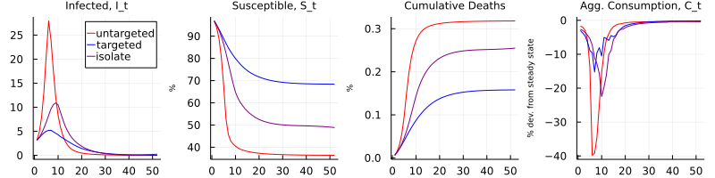

# Replication of Chari, Kirpalani, and Phelan (2021)

> This project was conducted as a final assignment for the PhD course [Numerical Methods](https://floswald.github.io/NumericalMethods/) at Bocconi University in Fall 2021.

This package replicates the main figures of Chari, Kirpalani, and Phelan (2021): "*The hammer and the scalpel: On the economics of indiscriminate versus targeted isolation policies during pandemics*", published in the Review of Economic Dynamics. The paper is available [here](https://doi.org/10.1016/j.red.2020.11.004), and the original replication material in Matlab [here](https://ideas.repec.org/c/red/ccodes/20-237.html).

The authors develop a theoretical model that combines epidemic transmission and economic outcomes. They study the effect of different government responses, such as quarantining, testing, contact-tracing, and isolation. 

## Installation

This package is not listed as an official Julia package. If you wish to use it, you may clone [this Github repository](https://github.com/JulianStreyczek/HammerScalpel.jl) to your machine. You then have two options:

**Use as a package:** Start up Julia and go into the package editor by typing `]`. Then, type

    activate .
    instantiate 

After pressing backspace, go back into Julia's standard command mode and type
    
    using HammerScalpel

The functions should now be ready to go.

**Use as ordinary code:** Play around with the files `main.jl` or `main_parallel.jl`, which run the code in sequential and parallelized form, respectively. 

## Using the package

If you wish run the replication from beginning to end, simply type

    solveModel()

This will call all necessary functions in the correct order. 
Specifically, it first computes the no-intervention outcome using [`nopolicy`](@ref), and the respective outcomes under the various policies using [`withpolicy`](@ref). Then, it plots the evolution of the model under different policies over time using [`createFig5`](@ref), [`createFig6`](@ref), and [`createFig7`](@ref).

Since solving the model may take a while, you have the option to run them more efficiently on multiple CPU cores at the same time. 
To do so, type

    solveModel(nprocs)

where `nprocs` specifies the number of logical cores on your CPU. 

If you just want to check my results without running the simulations yourself, you may use stored outcomes that I obtained under default parameters. You can recreate the figures by running

    createFig5()
    createFig6()
    createFig7()

## Documentation

```@docs
solveModel
nopolicy
withpolicy(::String)
createFig5(::Dict, ::Dict, ::Dict)
createFig6(::Dict, ::Dict, ::Dict)
createFig7(::Dict, ::Dict, ::Dict)
```

## Implementation details

**Optimization algorithm:** The authors originally use the algorithm SQP for maximizing the Bellman equation in each iteration, which in this case requires approximating gradients and Hessian.
For some policies, the [NLopt](https://github.com/JuliaOpt/NLopt.jl) algorithm LN\_BOBYQA finds the same solution with greater speed.
Therefore, although the replication results hold when using SQP everywhere, I use LN\_BOBYQA when applicable to improve speed.

**Forced stops:** When using the SQP implementation of [NLopt](https://github.com/JuliaOpt/NLopt.jl), called LN\_SLSQP, for optimization, the algorithm sometimes fails to converge, which is indicated by the return message `FORCED_STOP` (<1.5% of attempts). This is because the gradient of the objective cannot be computed in some edge cases. The authors solve this problem by adding a global optimization step in those cases. I chose not to do so because these additional steps slow down the computations a lot. Therefore, some of my figures are more jagged than those generated by the original Matlab code.

**Dimensionality:** The authors originally use 40 grid points for each control variable. In this replication, I reduced them to 20 for computational efficiency, which is why some of the time series are not exactly identical to the original and may look a bit jagged. 

**Inconsistencies:** In my replications of Figures 6 and 7, the time series for $R_0$ features a sharp increases for policies "targeted" and "isolate" around T=40 and T=50, respectively, which are not present in the published paper. I verified that these inconsistencies are also present when replicating the figures with the original Matlab code.